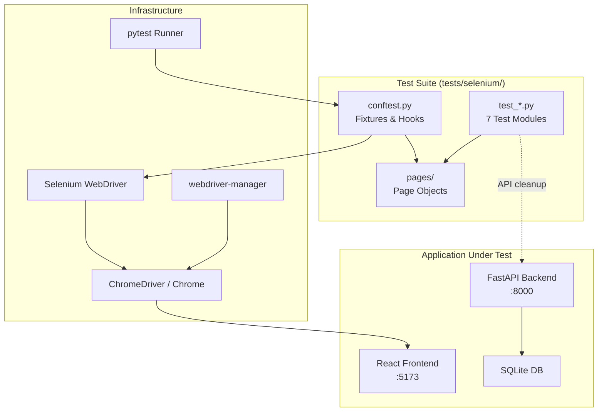
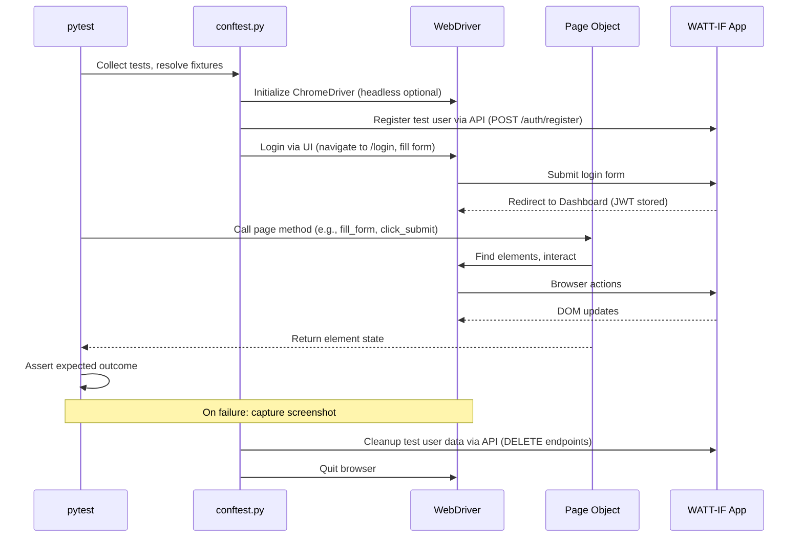

# Design Document: Selenium Automation Tests

## Overview

This design describes a Python Selenium automation test suite for the WATT-IF application. The suite automates 133 manual black-box test cases across 7 consolidated modules, using pytest as the test runner, Selenium WebDriver with ChromeDriver for browser automation, and the Page Object Model (POM) pattern for maintainability. The suite targets the locally-hosted WATT-IF application (React frontend on port 5173, FastAPI backend on port 8000).

The architecture prioritizes:
- **Traceability**: Every automated test maps 1:1 to a documented manual test case (e.g., `test_ACT_01_valid_registration` → ACT-01)
- **Isolation**: Tests use per-test user accounts and API-level cleanup to avoid interference
- **Reliability**: Explicit waits (no implicit waits) and retry-safe element interactions reduce flakiness
- **CI-readiness**: Headless mode, HTML reporting, and screenshot-on-failure support pipeline integration

## Architecture



### Layer Responsibilities

| Layer | Responsibility |
|-------|---------------|
| **Test Modules** (`test_*.py`) | Test logic: arrange fixtures, act via Page Objects, assert expected outcomes |
| **Page Objects** (`pages/`) | Encapsulate locators and interaction methods per page; shield tests from DOM changes |
| **Conftest** (`conftest.py`) | Shared fixtures: WebDriver lifecycle, auth sessions, test data setup/teardown |
| **pytest + plugins** | Discovery, execution, markers, HTML report generation, screenshot embedding |
| **Selenium + ChromeDriver** | Browser automation, element interaction, JavaScript execution |
| **webdriver-manager** | Automatic ChromeDriver binary management |

### Execution Flow



## Components and Interfaces

### 1. Page Object Classes (`tests/selenium/pages/`)

Each page object encapsulates element locators (using CSS selectors and data-testid attributes where available) and provides high-level interaction methods.

```python
# Base page with shared utilities
class BasePage:
    """Base class for all page objects."""
    
    def __init__(self, driver: WebDriver, base_url: str):
        self.driver = driver
        self.base_url = base_url
        self.wait = WebDriverWait(driver, 10)
    
    def navigate(self, path: str) -> None: ...
    def wait_for_element(self, locator: tuple, timeout: int = 10) -> WebElement: ...
    def wait_for_element_invisible(self, locator: tuple, timeout: int = 10) -> bool: ...
    def get_local_storage(self, key: str) -> str | None: ...
    def set_local_storage(self, key: str, value: str) -> None: ...
    def remove_local_storage(self, key: str) -> None: ...
    def get_current_url(self) -> str: ...
```

| Page Object | Key Methods |
|-------------|-------------|
| `LoginPage` | `login(email, password)`, `get_error_message()`, `is_submit_enabled()` |
| `RegisterPage` | `register(email, password, confirm)`, `get_error_message()`, `is_submit_enabled()` |
| `DashboardPage` | `get_stat_cards()`, `has_anomaly_card()`, `has_forecast_chart()`, `is_empty_state()` |
| `ForecastPage` | `select_horizon(n)`, `get_bar_count()`, `get_line_point_count()`, `hover_bar(index)`, `get_tooltip_text()`, `get_error_message()` |
| `AskPage` | `send_message(text)`, `get_messages()`, `clear_chat()`, `is_send_enabled()`, `get_input_length()` |
| `DataEntryPage` | `add_entry(month, kwh, bill?, rate?)`, `get_entry_rows()`, `get_entry_count()`, `edit_entry(row_idx, kwh)`, `delete_entry(row_idx)`, `confirm_dialog()`, `cancel_dialog()`, `upload_csv(path)`, `train_model()`, `get_training_status()`, `clear_all_data()`, `get_pagination_controls()`, `click_next_page()` |
| `PriceCalculatorPage` | `enter_kwh(value)`, `get_breakdown()`, `get_rate_display()`, `get_selected_bracket()`, `select_bracket(name)`, `change_customer_type(type)`, `refresh_rate()` |
| `AccountSettingsPage` | `change_password(current, new, confirm)`, `get_success_message()`, `get_error_message()`, `set_customer_type(type)`, `set_forecast_horizon(h)`, `set_rate_override(v)`, `clear_rate_override()`, `set_chat_max_history(v)`, `toggle_auto_clear()`, `set_notification_thresholds(kwh, bill, high)`, `toggle_auto_retrain()`, `set_min_data_points(v)` |
| `Sidebar` | `navigate_to(page)`, `get_active_link()`, `click_logout()`, `is_visible()`, `open_mobile_menu()`, `close_mobile_menu()` |
| `TopBar` | `toggle_dark_mode()`, `is_dark_mode()`, `click_settings_icon()`, `get_health_status()` |

### 2. Conftest Fixtures (`tests/selenium/conftest.py`)

```python
# Key fixtures provided:

@pytest.fixture(scope="session")
def base_url() -> str:
    """Application base URL from env or default."""

@pytest.fixture(scope="session")
def api_url() -> str:
    """API base URL from env or default."""

@pytest.fixture(scope="function")
def driver(request) -> Generator[WebDriver, None, None]:
    """Raw WebDriver instance with screenshot-on-failure hook."""

@pytest.fixture(scope="function")
def logged_in_driver(driver, base_url, api_url) -> Generator[WebDriver, None, None]:
    """WebDriver authenticated with a unique test user. Cleans up after."""

@pytest.fixture(scope="function")
def default_account_driver(driver, base_url) -> Generator[WebDriver, None, None]:
    """WebDriver authenticated as wattif@gmail.com / wattif."""

@pytest.fixture(scope="function")
def unauthenticated_driver(driver) -> Generator[WebDriver, None, None]:
    """WebDriver with no auth token."""

@pytest.fixture(scope="function")
def second_user_driver(driver, base_url, api_url) -> Generator[WebDriver, None, None]:
    """Second authenticated test user for data isolation tests."""

@pytest.fixture(scope="session")
def test_csv_path() -> Path:
    """Path to data/synthetic_2022_2025.csv for upload tests."""

def pytest_addoption(parser):
    """Add --headless CLI option."""

@pytest.hookimpl(hookwrapper=True)
def pytest_runtest_makereport(item, call):
    """Capture screenshot on test failure and embed in HTML report."""
```

### 3. Test Modules (`tests/selenium/test_*.py`)

| File | Test Cases | Marker | Fixture(s) Used |
|------|-----------|--------|-----------------|
| `test_account.py` | ACT-01 – ACT-22 | `@pytest.mark.account` | `driver`, `logged_in_driver`, `second_user_driver`, `unauthenticated_driver` |
| `test_data_management.py` | DM-01 – DM-40 | `@pytest.mark.data_management` | `logged_in_driver`, `test_csv_path` |
| `test_forecast_dashboard.py` | FD-01 – FD-20 | `@pytest.mark.forecast_dashboard` | `default_account_driver`, `logged_in_driver` |
| `test_chat.py` | CHT-01 – CHT-11 | `@pytest.mark.chat` | `logged_in_driver` |
| `test_price_calculator.py` | PCT-01 – PCT-13 | `@pytest.mark.price_calculator` | `logged_in_driver` |
| `test_settings.py` | SET-01 – SET-16 | `@pytest.mark.settings` | `logged_in_driver` |
| `test_system.py` | SYS-01 – SYS-11 | `@pytest.mark.system` | `logged_in_driver` |

### 4. Configuration Files

**`pytest.ini`**:
```ini
[pytest]
testpaths = tests/selenium
markers =
    account: Account system tests (ACT-01 to ACT-22)
    data_management: Data management tests (DM-01 to DM-40)
    forecast_dashboard: Forecasting and dashboard tests (FD-01 to FD-20)
    chat: Chat assistant tests (CHT-01 to CHT-11)
    price_calculator: Price calculator tests (PCT-01 to PCT-13)
    settings: Settings page tests (SET-01 to SET-16)
    system: System and infrastructure tests (SYS-01 to SYS-11)
    manual: Tests requiring manual execution
addopts = --html=reports/report.html --self-contained-html -v
```

**`requirements.txt`**:
```
selenium==4.25.0
pytest==8.3.4
pytest-html==4.1.1
webdriver-manager==4.0.2
requests==2.32.3
```

## Data Models

### Test User Model

```python
@dataclass
class TestUser:
    """Represents a test user created during test setup."""
    email: str          # Generated unique email (e.g., test_<uuid>@test.com)
    password: str       # Static test password (e.g., "TestPass123")
    token: str | None   # JWT after login, used for API cleanup calls
```

### Page Object Locator Strategy

Locators are organized as class-level constants using Selenium's `By` strategies:

```python
class LoginPage(BasePage):
    # Locators
    EMAIL_INPUT = (By.CSS_SELECTOR, "input[type='email']")
    PASSWORD_INPUT = (By.CSS_SELECTOR, "input[type='password']")
    SUBMIT_BUTTON = (By.CSS_SELECTOR, "button[type='submit']")
    ERROR_MESSAGE = (By.CSS_SELECTOR, "[data-testid='error-message'], .error-message, [role='alert']")
    REGISTER_LINK = (By.CSS_SELECTOR, "a[href='/register']")
```

### Test Data

| Data Asset | Location | Purpose |
|-----------|----------|---------|
| `synthetic_2022_2025.csv` | `data/synthetic_2022_2025.csv` | 48-row dataset for upload, train, forecast tests |
| Generated CSVs | `tests/selenium/fixtures/` | Invalid CSVs (wrong format, missing columns, etc.) for negative tests |
| Test users | Created at runtime via API | Unique per-test users for isolation |

### Screenshot and Report Data

```
reports/
├── report.html          # pytest-html consolidated report
└── screenshots/         # PNG screenshots captured on test failure
    ├── test_ACT_01_valid_registration_FAILED.png
    └── ...
```

## Error Handling

### WebDriver Initialization Failures

If Chrome or ChromeDriver cannot be initialized (browser not installed, version mismatch, display server unavailable):
- The `driver` fixture catches the exception and calls `pytest.skip()` with a descriptive message
- All dependent tests are marked as SKIPPED rather than ERROR, keeping the test run intact

### Element Interaction Failures

| Scenario | Handling |
|----------|----------|
| Element not found within timeout | `TimeoutException` raised; test fails with clear message indicating which element was expected |
| Element present but not interactable | `ElementNotInteractableException` caught; retry after brief wait (scrolling into view) |
| Stale element reference | Retry locating the element once before failing |
| Alert/dialog unexpectedly present | `UnexpectedAlertPresentException` caught; dismiss and retry |

### Test Data Cleanup Failures

If API cleanup (DELETE user data) fails after a test:
- Log a warning but do not fail the test (the test already passed/failed on its own merit)
- Subsequent tests create fresh users with unique emails, avoiding data collision

### Network and Application Errors

| Scenario | Handling |
|----------|----------|
| Application not responding on base_url | Fixture-level check at session start; skip all tests with descriptive message |
| API returns 5xx during fixture setup | Retry once after 2-second delay; skip if still failing |
| Page load timeout | Default 30-second page load timeout; test fails if exceeded |

## Testing Strategy

### Test Categories

This test suite is itself an end-to-end (E2E) testing tool. The testing strategy for the suite itself covers:

1. **Smoke validation**: Before running the full suite, a lightweight health check fixture verifies both the frontend (`GET /` returns 200) and backend (`GET /health` returns "ok") are reachable. If either is down, the entire session is skipped with a clear message.

2. **Example-based functional tests**: Every test case is an example-based test with specific inputs and expected outcomes derived from the manual test case documents. Each `test_<PREFIX>_<ID>_<description>` function exercises one discrete scenario.

3. **Boundary value tests**: Tests like DM-06 (kWh=1), DM-07 (kWh=1,000,000), DM-08 (kWh=1,000,001) exercise boundaries.

4. **Negative tests**: Invalid inputs (empty fields, wrong formats, unauthorized access) verify graceful error handling.

5. **Integration tests**: Data isolation tests (ACT-15 through ACT-18) verify end-to-end behavior across multiple user sessions.

### Why Property-Based Testing Does NOT Apply

Property-based testing is not appropriate for this feature because:

- **The test suite is a UI automation framework**, not a function with variable inputs. Each test exercises a specific, documented manual test scenario with concrete steps and expected outcomes.
- **Tests are interaction-based**, involving browser navigation, element clicks, form fills, and DOM assertions. These are inherently example-based, not universal properties.
- **There are no pure functions** to test with generated inputs. The "code under test" is the WATT-IF application itself, tested through the browser.
- **Each test maps 1:1 to a manual test case** with fixed test data and fixed expected results.

The appropriate testing approach is **example-based E2E testing** with screenshot capture on failure and HTML reporting.

### Execution Modes

| Mode | Command | Use Case |
|------|---------|----------|
| Full suite | `pytest` | CI pipeline, full regression |
| Single module | `pytest -m data_management` | Focused testing after data entry changes |
| Account tests | `pytest -m account` | Focused testing after auth changes |
| Forecast & Dashboard | `pytest -m forecast_dashboard` | After forecast/dashboard changes |
| Chat tests | `pytest -m chat` | After chat feature changes |
| Price calculator | `pytest -m price_calculator` | After calculator changes |
| Settings tests | `pytest -m settings` | After settings page changes |
| System tests | `pytest -m system` | After UI/UX or infrastructure changes |
| Headless | `pytest --headless` | CI/CD without display server |
| Specific test | `pytest -k "test_ACT_01"` | Debugging a single case |
| With re-runs | `pytest --reruns 2` | Flaky test mitigation (optional plugin) |

### Test Naming Convention

```
test_<PREFIX>_<ID>_<snake_case_description>
```

Examples:
- `test_ACT_01_valid_registration`
- `test_DM_13_upload_valid_csv`
- `test_FD_01_default_forecast`
- `test_SYS_01_dark_mode_toggle`
- `test_CHT_04_empty_message_disabled`
- `test_PCT_07_bracket_auto_selection`
- `test_SET_03_customer_type_change`

### Execution Order and Dependencies

Tests within a module may have ordering dependencies (e.g., train model requires data upload). These are handled by:
1. **Fixtures** that prepare required state (upload CSV, create entries)
2. **`pytest-ordering`** markers where strict sequencing is needed
3. **API-level setup** in fixtures rather than relying on prior test execution

### Excluded Tests (Manual Only)

Tests marked with `@pytest.mark.manual` are collected but automatically skipped:
- **SYS-10** (Health degraded — Ollama offline): Requires stopping external Ollama service
- **SYS-11** (Offline banner): Requires disconnecting the network
- **FD-20** (Loading skeleton with throttled network): Requires DevTools network throttling
- **PCT-13** (Calculator with API unavailable): Requires disconnecting internet mid-test
- **CHT-10** (Ollama offline error): Requires stopping external Ollama service
- **ACT-09** (Rate limiting): Timing-dependent rate limit windows make this flaky
- **ACT-11** (Logout offline): Requires simulating network disconnect mid-session
- **ACT-13** (Expired token): Requires waiting 24 hours or manual JWT tampering

Each carries a `reason` string explaining why manual execution is required.
