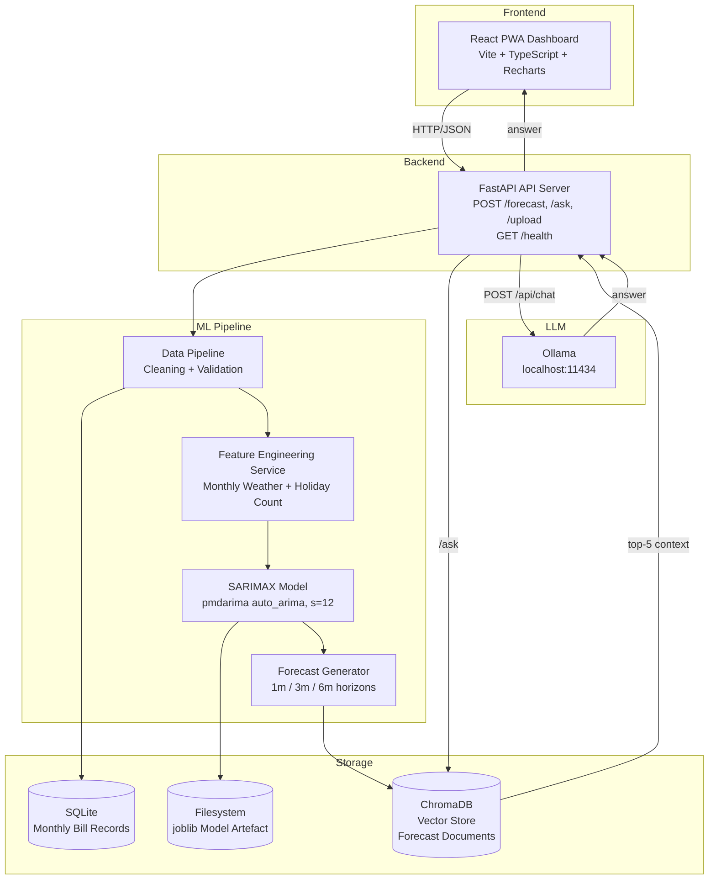

# Design Document: WATT-IF

## Overview

WATT-IF is a locally-hosted Progressive Web Application that gives household users a clear picture of their future monthly electricity bills. The system accepts a CSV of historical monthly bills (one row = one billing period), processes it through a deterministic ETL pipeline, trains a SARIMAX time-series model enriched with monthly weather and holiday exogenous variables, stores forecast output as semantic documents in a vector database, and surfaces both chart-based visualisations and natural-language question-answering through a React PWA frontend.

All computation happens on the user's machine. No bill data leaves the device. The Qwen3 8B Instruct model runs via Ollama on `localhost:11434`, the FastAPI backend runs on a local port, and the React/Vite frontend is served as a PWA that can be installed and used offline.

### Key Design Decisions

- **Monthly granularity throughout**: Household electricity bills arrive monthly. The input CSV, the training data, and the forecast output all operate at monthly granularity. This eliminates the need to aggregate daily readings and keeps the dataset size manageable for SARIMAX.
- **SARIMAX with s=12**: Annual seasonality (s=12) is the natural period for monthly household energy data — winter heating peaks repeat every 12 months. `auto_arima` with `seasonal=True, m=12` will find the best (P, D, Q, 12) seasonal component automatically.
- **Three exogenous variables**: Monthly mean temperature, monthly total precipitation, and a public-holiday count per month. All are already numeric — no ordinal encoding step needed.
- **Forecast horizons of 1, 3, and 6 months**: Matches real budget-planning cadences. 1 month = next bill estimate; 3 months = quarterly view; 6 months = half-year budget.
- **ChromaDB for the vector store**: Ships with a native `sentence-transformers` wrapper, supports metadata filtering, and provides upsert semantics. Runs as an embedded library — no separate server.
- **Ollama for LLM serving**: Manages model download and REST API for `qwen3:8b`. The FastAPI backend communicates over HTTP.
- **Vite + vite-plugin-pwa**: Zero-config Workbox service worker, covering offline caching of static assets and runtime caching of `/forecast` responses.
- **Single-user, local-only architecture**: No multi-tenancy, no cloud persistence, no shared state between sessions beyond the local SQLite database and vector store files.

---

## Architecture



### Request Flow — Forecast

1. User selects a horizon (1 / 3 / 6 months) in the PWA.
2. PWA sends `POST /forecast` with `{"horizon": 3}`.
3. API Server loads the persisted SARIMAX model artefact from disk.
4. If exogenous variables are not provided, fallback means over all historical months are computed from SQLite.
5. SARIMAX model generates point forecasts + 95% CI for each month.
6. Each month's forecast is upserted into ChromaDB as a Forecast Document.
7. API returns the full forecast array to the PWA.
8. PWA renders the Recharts bar/line chart with CI bands.

### Request Flow — Question Answering

1. User types a question in the chat input.
2. PWA sends `POST /ask` with `{"question": "..."}`.
3. API Server embeds the question and retrieves top-5 Forecast Documents from ChromaDB.
4. If no documents exist, return a "no forecast data" message immediately.
5. The 5 documents are serialised as context and sent to Ollama `POST /api/chat` with `qwen3:8b`.
6. A 30-second timeout is enforced on the Ollama call.
7. The generated answer is appended to the chat thread in the PWA.

### Request Flow — Upload

1. User selects a CSV file in the file picker.
2. PWA sends `POST /upload` (multipart/form-data).
3. API Server validates path traversal, file extension, and file size (≤10 MB).
4. Data Pipeline runs: parse → validate → clean → feature engineer.
5. If the new data adds ≥1 new calendar month, model retraining is triggered.
6. API returns acknowledgement with row count and validation summary.

---

## Components and Interfaces

### 1. Data Pipeline (`pipeline/data_pipeline.py`)

Responsible for ingesting and cleaning raw monthly CSV bill data.

**Public Interface:**

```python
class DataPipeline:
    def ingest(self, file_path: str) -> IngestResult:
        """
        Validates columns, parses year_month values, imputes missing values,
        removes duplicates, and persists MonthlyRecords to SQLite.
        Returns IngestResult with row_count, cleaning_report, and validation_status.
        """

    def get_monthly_records(self, start: str, end: str) -> list[MonthlyRecord]:
        """Returns MonthlyRecords from SQLite between start and end (YYYY-MM, inclusive)."""

    def get_training_window_extent(self) -> tuple[str, str]:
        """Returns (earliest_year_month, latest_year_month) of persisted records."""
```

**Cleaning Steps (in order):**
1. Column presence check — fail fast if `year_month` / `kwh` / `price` missing.
2. `year_month` format validation — regex `^\d{4}-\d{2}$`; reject non-conforming rows.
3. kWh/price nulls/non-numeric → linear interpolation; edge cases forward/backward fill.
4. Duplicate `year_month` rows → keep last by row order, log count removed.
5. Sort by `year_month` ascending.
6. Persist to SQLite `monthly_bill_records` table (upsert on `year_month`).

### 2. Feature Engineering Service (`pipeline/feature_engineering.py`)

Enriches monthly bill records with weather and holiday exogenous variables.

**Public Interface:**

```python
class FeatureEngineeringService:
    def enrich(self, records: list[MonthlyRecord]) -> list[EnrichedRecord]:
        """
        Attaches mean_temp_c, total_precip_mm, and holiday_count to each MonthlyRecord.
        Logs warnings for carry-forward and errors for unavailable weather.
        """

    def enrich_forecast_horizon(self, months: list[str]) -> list[ExogenousRow]:
        """
        Returns ExogenousRow values for a list of future YYYY-MM strings.
        Uses open-meteo climate forecast data and holidays library.
        """
```

**Weather Integration:** Uses the `open-meteo` Python client (free, no API key) to retrieve monthly aggregated historical and forecast weather data. Falls back to carry-forward from the preceding month, then null-fill with error logging.

**Holiday Integration:** Uses the `holidays` Python library. `holiday_count` = number of public holidays in that calendar month for the configured country/region.

**Exogenous Variables (all numeric, no encoding needed):**

| Field | Type | Description |
|---|---|---|
| `mean_temp_c` | float | Monthly mean temperature (°C) |
| `total_precip_mm` | float | Monthly total precipitation (mm) |
| `holiday_count` | int | Number of public holidays in the month |

### 3. SARIMAX Model (`model/sarimax_model.py`)

Wraps pmdarima `auto_arima` (with `m=12`) for order selection and `statsmodels` SARIMAX for training and forecasting.

**Public Interface:**

```python
class SARIMAXModel:
    def train(self, records: list[EnrichedRecord]) -> TrainingResult:
        """
        Selects order via auto_arima (AIC, m=12), trains on 80% of records,
        validates MAPE on held-out 10% validation set, reserves final 10% as test set.
        80/10/10 chronological split (train/validation/test).
        Persists artefact via joblib.
        Raises ModelTrainingError on convergence failure or insufficient data (<14 months).
        """

    def forecast(
        self,
        horizon: int,
        exog: list[ExogenousRow] | None = None
    ) -> list[ForecastMonth]:
        """
        Produces point forecasts + 95% CI for kWh and price for `horizon` months.
        Uses fallback exogenous means if exog is None.
        All values clamped to >= 0.
        """

    def load(self, path: str) -> None:
        """Loads a persisted joblib artefact from disk."""

    def backup(self) -> str:
        """Copies current artefact to a versioned backup path. Returns backup path."""

    def delete_backup(self, backup_path: str) -> None:
        """Removes backup artefact after successful retraining."""
```

**Artefact Schema (joblib pickle):**

```python
{
    "model": fitted_sarimax_model,       # statsmodels SARIMAXResultsWrapper
    "order": (p, d, q),
    "seasonal_order": (P, D, Q, 12),     # s=12 fixed
    "exog_columns": ["mean_temp_c", "total_precip_mm", "holiday_count"],
    "trained_at": "ISO-8601 datetime string",
    "mape_validation": float,
    "training_window": {"start": "YYYY-MM", "end": "YYYY-MM"}
}
```

### 4. Vector Store (`storage/vector_store.py`)

Wraps ChromaDB with sentence-transformers embeddings for Forecast Document storage and retrieval.

**Public Interface:**

```python
class VectorStore:
    def upsert(self, doc: ForecastDocument) -> None:
        """
        Embeds and upserts a Forecast Document.
        Document ID: "{forecast_month}_{horizon_label}" (e.g. "2026-03_3m").
        Raises VectorStoreError on embedding failure.
        """

    def query(self, question: str, top_k: int = 5) -> list[ForecastDocument]:
        """
        Embeds the question and returns up to top_k most similar documents
        ranked by cosine similarity. Returns empty list if store is empty.
        """

    def collection_size(self) -> int:
        """Returns total number of documents in the collection."""
```

**Embedding Model:** `all-MiniLM-L6-v2` from sentence-transformers.

**Document ID Strategy:** `f"{forecast_month}_{horizon_label}"` (e.g. `"2026-03_3m"`) ensures upsert replaces existing documents for the same month+horizon combination.

### 5. RAG Service (`rag/rag_service.py`)

Orchestrates retrieval from ChromaDB and generation via Ollama.

**Public Interface:**

```python
class RAGService:
    def answer(self, question: str) -> RAGResponse:
        """
        Retrieves top-5 Forecast Documents, constructs a grounded prompt,
        calls Ollama /api/chat with qwen3:8b, enforces 30s timeout.
        Returns RAGResponse with answer text and source document references.
        """
```

**Prompt Template:**

```
You are a household electricity bill assistant. Answer the user's question using ONLY the monthly forecast data provided below.
Do not speculate or invent figures not present in the data.
If the data does not contain the answer, say "The requested information is not available in the current forecast."

Forecast Data:
{context_documents}

Question: {question}
Answer:
```

**Ollama Call:**

```python
POST http://localhost:11434/api/chat
{
    "model": "qwen3:8b",
    "messages": [{"role": "user", "content": prompt}],
    "stream": false,
    "options": {"temperature": 0.1}
}
```

Timeout: `httpx.AsyncClient(timeout=30.0)`.

### 6. API Server (`api/main.py`)

FastAPI application exposing four endpoints.

**Endpoint Definitions:**

| Method | Path | Request Body | Response |
|---|---|---|---|
| POST | /upload | `multipart/form-data` file (≤10 MB, .csv only) | `UploadResponse` |
| POST | /forecast | `ForecastRequest {horizon: int, one of [1, 3, 6]}` | `ForecastResponse` |
| POST | /ask | `AskRequest {question: str [1-500 chars]}` | `AskResponse` |
| GET | /health | — | `HealthResponse` |

**Error Handling:**

- Pydantic validation failure → HTTP 422 with field-level error detail.
- Path traversal / injection detected → HTTP 400 with descriptive message.
- LLM unavailable (Ollama unreachable) → HTTP 503.
- Unhandled exceptions → HTTP 500 + full stack trace logged via Python `logging`.

**CORS Configuration:**

```python
app.add_middleware(
    CORSMiddleware,
    allow_origins=["http://localhost:5173"],
    allow_methods=["GET", "POST", "OPTIONS"],
    allow_headers=["*"],
)
```

### 7. PWA Dashboard (`frontend/src/`)

React 18 / Vite / TypeScript application.

**Key Components:**

| Component | Responsibility |
|---|---|
| `ForecastChart` | Recharts `ComposedChart` with `Bar` (kWh/price per month), `Area` (95% CI bands), month x-axis, unit y-axis |
| `HorizonSelector` | Button group for 1m / 3m / 6m, triggers `POST /forecast` |
| `ChatPanel` | Scrollable message thread + 500-char text input + submit |
| `UploadPanel` | CSV file picker (`.csv` only), loading spinner, success/error notifications |
| `OfflineBanner` | Persistent banner when `navigator.onLine === false` |
| `HealthIndicator` | Polls `GET /health` on mount, shows subsystem status |

**Service Worker Strategy:**

- Static assets: `CacheFirst`.
- `/forecast` responses: `NetworkFirst` with 24-hour TTL.
- `/ask` responses: `NetworkOnly`.

---

## Data Models

### Bill Dataset (raw input)

```
CSV columns (minimum required):
  year_month  — string, YYYY-MM format (e.g. "2024-01")
  kwh         — numeric, total electricity consumption for the month
  price       — numeric, total electricity cost for the month
```

### MonthlyRecord

```python
@dataclass
class MonthlyRecord:
    year_month: str   # YYYY-MM
    kwh: float        # total kWh for the month
    price: float      # total price for the month
```

### EnrichedRecord

```python
@dataclass
class EnrichedRecord:
    year_month: str
    kwh: float
    price: float
    mean_temp_c: float | None       # monthly mean temperature
    total_precip_mm: float | None   # monthly total precipitation
    holiday_count: int              # public holidays in the month (default 0)
```

### ExogenousRow (forecast input)

```python
@dataclass
class ExogenousRow:
    year_month: str
    mean_temp_c: float
    total_precip_mm: float
    holiday_count: int
```

### ForecastMonth

```python
@dataclass
class ForecastMonth:
    year_month: str           # YYYY-MM
    kwh_forecast: float       # point forecast, clamped >= 0
    kwh_lower_95: float       # lower bound of 95% CI, clamped >= 0
    kwh_upper_95: float       # upper bound of 95% CI, clamped >= 0
    price_forecast: float
    price_lower_95: float
    price_upper_95: float
```

### ForecastDocument (stored in ChromaDB)

```python
@dataclass
class ForecastDocument:
    id: str                    # "{forecast_month}_{horizon_label}"  e.g. "2026-03_3m"
    text: str                  # human-readable summary for embedding
    metadata: ForecastMetadata

@dataclass
class ForecastMetadata:
    forecast_month: str        # YYYY-MM
    forecasted_kwh: float      # non-negative
    forecasted_price: float    # non-negative
    horizon_label: str         # "1m" | "3m" | "6m"
```

**Forecast Document Text Format:**

```
Forecast for {year_month} (horizon: {horizon_label}):
  Electricity consumption: {kwh_forecast:.2f} kWh (95% CI: {kwh_lower:.2f} – {kwh_upper:.2f})
  Electricity price: £{price_forecast:.2f} (95% CI: £{price_lower:.2f} – £{price_upper:.2f})
```

### CleaningReport

```python
@dataclass
class CleaningReport:
    total_rows_received: int
    rows_with_invalid_year_month: list[dict]  # {row_index, original_value}
    rows_imputed: list[dict]                  # {row_index, field, original, replacement}
    duplicate_rows_removed: int
    rows_after_cleaning: int
```

### IngestResult

```python
@dataclass
class IngestResult:
    validation_status: Literal["ok", "error"]
    error_message: str | None
    row_count: int
    cleaning_report: CleaningReport | None
```

### API Request/Response Models

```python
class ForecastRequest(BaseModel):
    horizon: int = Field(..., description="Forecast horizon in months: must be 1, 3, or 6")
    exog: list[ExogenousRow] | None = None   # optional; fallback used if absent

    @validator("horizon")
    def horizon_must_be_valid(cls, v):
        if v not in (1, 3, 6):
            raise ValueError("horizon must be 1, 3, or 6")
        return v

class ForecastResponse(BaseModel):
    horizon: int
    months: list[ForecastMonth]

class AskRequest(BaseModel):
    question: str = Field(..., min_length=1, max_length=500)

class AskResponse(BaseModel):
    answer: str
    sources: list[ForecastMetadata]

class UploadResponse(BaseModel):
    rows_received: int
    validation_status: str
    cleaning_report: CleaningReport | None
    retraining_triggered: bool

class HealthResponse(BaseModel):
    status: Literal["ok", "degraded"]
    subsystems: dict[str, Literal["operational", "degraded"]]
```

### SQLite Schema

```sql
CREATE TABLE monthly_bill_records (
    year_month  TEXT PRIMARY KEY,    -- YYYY-MM
    kwh         REAL NOT NULL,
    price       REAL NOT NULL,
    session_id  TEXT NOT NULL,
    created_at  TEXT NOT NULL        -- ISO 8601 datetime
);

CREATE TABLE training_log (
    id                    INTEGER PRIMARY KEY AUTOINCREMENT,
    trained_at            TEXT NOT NULL,
    previous_mape         REAL,
    new_mape              REAL NOT NULL,
    training_window_start TEXT NOT NULL,   -- YYYY-MM
    training_window_end   TEXT NOT NULL    -- YYYY-MM
);
```

---

## Correctness Properties

### Property 1: Column Validation Accepts Complete CSV and Rejects Incomplete CSV

*For any* CSV input, the Data Pipeline SHALL accept the file if and only if all three required columns (`year_month`, `kwh`, `price`) are present; if one or more are missing, the pipeline SHALL reject with an error identifying the missing column(s) and SHALL NOT perform further processing.

**Validates: Requirements 1.1, 1.2, 1.3**

---

### Property 2: year_month Validation Accepts YYYY-MM and Rejects Non-Conforming Values

*For any* `year_month` string that matches `^\d{4}-\d{2}$`, the pipeline SHALL accept the row; for any string that does not match, the row SHALL be rejected and recorded in the cleaning report.

**Validates: Requirements 1.4, 1.5**

---

### Property 3: kWh/Price Imputation Produces Correct Interpolated Value

*For any* sequence of monthly records where a single kWh or price value is null and is bracketed by valid values `a` and `b`, the imputed value SHALL equal `(a + b) / 2` within floating-point tolerance.

**Validates: Requirements 1.6, 1.7**

---

### Property 4: Deduplication Retains Last Occurrence Per year_month

*For any* dataset containing duplicate `year_month` rows, the cleaned output SHALL contain at most one row per `year_month`, and the retained row SHALL be the last-occurring by input row order.

**Validates: Requirements 1.8**

---

### Property 5: Monthly Records Are Persisted and Retrievable

*For any* valid Bill_Dataset, after ingest the `monthly_bill_records` table SHALL contain exactly one row per unique `year_month` in the cleaned dataset.

**Validates: Requirements 1.9**

---

### Property 6: Feature Engineering Produces Complete Enriched Records

*For any* monthly record where weather data is available, the enriched record SHALL contain non-null values for `mean_temp_c`, `total_precip_mm`, and `holiday_count`; `holiday_count` SHALL be a non-negative integer for all records regardless of calendar source availability.

**Validates: Requirements 2.1, 2.2, 2.5**

---

### Property 7: Training Artefact Round-Trip Preserves All Fields

*For any* training run on a dataset with ≥14 monthly records that converges, the artefact persisted to disk SHALL survive a joblib serialise–deserialise round trip with all fields intact.

**Validates: Requirements 3.2, 3.3**

---

### Property 8: Forecast Values Are Non-Negative

*For any* horizon in {1, 3, 6} and any exogenous inputs, all values in the returned forecast (point and both CI bounds, for both kWh and price) SHALL be ≥ 0.

**Validates: Requirements 4.1**

---

### Property 9: Exogenous Fallback Values Equal Historical Means

*For any* training history, when a forecast is requested without exogenous values, each fallback exogenous value SHALL equal the mean of that variable over all available historical monthly records.

**Validates: Requirements 4.4**

---

### Property 10: Forecast Documents Are Persisted and Retrievable

*For any* forecast run over horizon H months, after the run completes the vector store SHALL contain retrievable Forecast Documents for all H forecast months, and each document's metadata SHALL match the corresponding ForecastMonth output.

**Validates: Requirements 4.5, 5.1**

---

### Property 11: Query Results Have Correct Count and Metadata Schema

*For any* query against a vector store containing N documents, the result count SHALL equal min(5, N); every returned document SHALL have metadata with exactly four fields: `forecast_month` (YYYY-MM), `forecasted_kwh` (≥0), `forecasted_price` (≥0), `horizon_label` (one of "1m", "3m", "6m").

**Validates: Requirements 5.2, 5.3**

---

### Property 12: Upsert on Duplicate Forecast Month Produces No Duplicates

*For any* `forecast_month` and `horizon_label`, upserting a Forecast Document with that pair a second time SHALL result in exactly one document for that pair, reflecting the most recent upsert.

**Validates: Requirements 5.5**

---

### Property 13: Forecast Endpoint Returns Correct Month Count for Any Valid Horizon

*For any* horizon value in {1, 3, 6}, the `POST /forecast` endpoint SHALL return a response containing exactly `horizon` ForecastMonth entries.

**Validates: Requirements 7.1**

---

### Property 14: Invalid API Inputs Return HTTP 422 with Field-Level Errors

*For any* request to `POST /forecast` with a horizon not in {1, 3, 6}, or any request to `POST /ask` with an empty or >500 character question, the API Server SHALL return HTTP 422 identifying the invalid field.

**Validates: Requirements 7.4**

---

### Property 15: Health Endpoint Reflects Subsystem State

*For any* combination of subsystem states, `GET /health` SHALL return HTTP 200 iff all four subsystems are operational; it SHALL return HTTP 207 if any is degraded, with per-subsystem status in the payload.

**Validates: Requirements 7.7, 7.8**

---

### Property 16: Forecast Chart Renders CI Bands for All Forecast Data

*For any* non-empty array of ForecastMonth records passed to ForecastChart, the rendered output SHALL contain visible Area elements representing the 95% CI bands, and the forecast line/bar SHALL not be occluded.

**Validates: Requirements 8.3**

---

### Property 17: Chat Thread Maintains Chronological Message Order

*For any* sequence of question-answer pairs, the rendered chat thread SHALL display all messages chronologically (oldest top, newest bottom).

**Validates: Requirements 8.5**

---

### Property 18: Retraining Is Triggered If and Only If a New Calendar Month Is Added

*For any* pair of (previous_latest_year_month, new_latest_year_month), retraining SHALL be triggered if and only if `new_latest_year_month > previous_latest_year_month`.

**Validates: Requirements 9.1**

---

### Property 19: Failed Retraining Leaves Existing Model Artefact Unchanged

*For any* retraining run where any step fails, the model artefact SHALL be byte-for-byte identical to the artefact that existed before the run.

**Validates: Requirements 9.3**

---

### Property 20: Model Backup Is Created Before Artefact Is Overwritten

*For any* retraining run, a versioned backup SHALL exist on disk before the new artefact is written; after successful completion the backup SHALL be deleted.

**Validates: Requirements 9.5, 9.6**

---

### Property 21: Path Traversal Filenames Are Rejected with HTTP 400

*For any* upload request whose filename contains path traversal sequences, the API Server SHALL return HTTP 400 and SHALL NOT write any content to disk or database.

**Validates: Requirements 10.2**

---

### Property 22: Session Isolation Prevents Cross-Session Data Access

*For any* two distinct session identifiers A and B, records uploaded under session A SHALL NOT be returned by any query or API response made under session B.

**Validates: Requirements 10.5**

---

## Error Handling

### Data Pipeline Errors

| Error Condition | Behaviour |
|---|---|
| Missing required column | Return `IngestResult(validation_status="error")`; halt pipeline |
| Invalid `year_month` format in row | Reject row; add to `rows_with_invalid_year_month`; continue |
| Null/non-numeric kWh or price | Impute via interpolation or fill; flag in `rows_imputed` |
| No bracketing values for interpolation | Forward-fill or backward-fill; flag in cleaning report |
| File exceeds 10 MB | API layer rejects; HTTP 400 |
| File is not CSV | API layer rejects; HTTP 400 |
| Path traversal in filename | API layer rejects; HTTP 400; no disk write |

### Feature Engineering Errors

| Error Condition | Behaviour |
|---|---|
| Weather API unavailable for month | Carry forward from prior month; log WARNING |
| No prior monthly weather observation | Set weather fields to null; log ERROR; continue |
| Holiday source unavailable | Default `holiday_count` to 0; log WARNING; continue |

### Model Training Errors

| Error Condition | Behaviour |
|---|---|
| Fewer than 14 monthly records | Log ERROR; raise `ModelTrainingError`; do not write artefact |
| `auto_arima` convergence failure | Log ERROR; do not write artefact |
| MAPE > 30% | Log WARNING; persist artefact |

### Forecast Generation Errors

| Error Condition | Behaviour |
|---|---|
| Fewer than 14 historical monthly records | Return error; no forecast produced |
| Vector store write failure for a month | Retry once; if retry fails, log ERROR and continue |

### RAG / LLM Errors

| Error Condition | Behaviour |
|---|---|
| Vector store unreachable | Return error response; do NOT call Ollama |
| Zero documents retrieved | Return "no forecast data available" message |
| Ollama timeout (>30s) | Cancel generation; return timeout error response |
| Ollama unreachable | Return HTTP 503 to caller |
